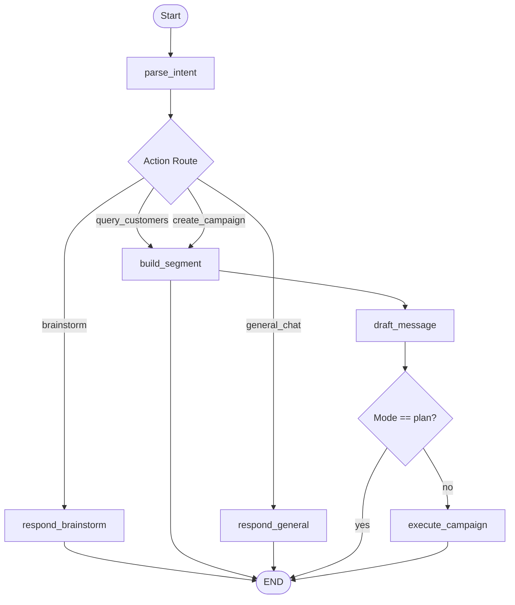

# 🏗️ Xeno AI CRM — System Architecture

This document details the software architecture, design patterns, and components of the **Xeno AI CRM** system.

---

## 1. High-Level Overview

The system consists of three primary services coordinating to deliver a conversational, AI-driven campaign lifecycle:

```
                      ┌────────────────────────┐
                      │    React Frontend      │
                      │  (Chat & Dashboard)    │
                      └──────────┬─────────────┘
                                 │ HTTP / SSE
                                 ▼
                      ┌────────────────────────┐
                      │      CRM Service       │
                      │   (FastAPI Backend)    │
                      └────┬──────┬──────────┬─┘
                           │      │          │
        PostgreSQL / Redis │      │ HTTP     │ SSE Callback
                           ▼      ▼          ▼
             ┌───────────────┐  ┌───────────────┐
             │  Data Stores  │  │Channel Service│
             └───────────────┘  └───────────────┘
```

1. **React Frontend (Port 5173)**:
   - Single Page Application built with Vite and TypeScript.
   - Houses the **3-Phase Campaign Studio Wizard** (Brainstorm → Plan → Execute) and the campaign analytics dashboard.
   - Listens to real-time status notifications and delivery updates via Server-Sent Events (SSE).

2. **CRM Service (Port 8000)**:
   - Python FastAPI backend serving as the orchestrator.
   - Evaluates intents, writes PostgreSQL queries, segment definitions, drafts channels copy, and tracks delivery statistics.
   - Embeds a stateful LangGraph agent that coordinates with Gemini and Groq APIs.

3. **Channel Service (Port 8001)**:
   - FastAPI simulator that receives messages and schedules asynchronous mock delivery callbacks (sent, delivered, opened, clicked) to simulate real-world provider events.

---

## 2. AI Agent & Orchestration Engine

The CRM service utilizes **LangGraph** to model the campaign creation process as a stateful, directed graph.

### State Graph Architecture



- **Intent Parsing (`parse_intent`)**: Evaluates the marketer's message and history to classify the action (`brainstorm`, `query_customers`, `create_campaign`, `general_chat`) and extracts update briefs.
- **ReAct Brainstorm (`respond_brainstorm`)**: Executes a data-driven reasoning loop. If the LLM determines it needs customer database statistics to guide the conversation (e.g. counting customers matching criteria in specific cities), it generates a read-only SQL query, runs it securely via `SQLGuard`, and injects stats into its strategical reply.
- **Plan Review Guard**: In `plan` mode, the graph routes from `draft_message` directly to the `END` block using a conditional edge (`_route_after_draft`). This ensures that campaign rows are *never* pre-created in the database during the plan preview phase, preventing duplicate campaign rows.
- **Campaign Execution (`execute_campaign`)**: Saves the saving segment definitions, generates the campaign rows, and launches a background thread task to dispatch messages.

### Dual-Model LLM Configuration with Prioritized Model Cycling
The CRM backend leverages a dual-LLM client configuration to optimize speed and reasoning:
1. **Gemini 2.0 Flash (Primary Reasoning)**: Handles structured output, database query planning, and SQL generation.
2. **Groq Llama 3 (Fast Text Generation & Fallback)**: Drafts channel marketing copy and serves as a highly robust fallback model if Gemini rate limits occur.

#### Resilient Model Fallback Pipeline
To resolve rate limits (`429 RESOURCE_EXHAUSTED`) or API failures, the `DualLLMClient` incorporates:
- **Prioritized Model Cycling**: If a model fails, it cycles sequentially through a pool of 6 Groq models:
  1. `llama-3.3-70b-versatile`
  2. `llama-3.1-70b-versatile`
  3. `llama3-70b-8192`
  4. `llama-3.1-8b-instant`
  5. `llama3-8b-8192`
  6. `mixtral-8x7b-32768`
- **JSON Formatting Retry**: Groq JSON-mode requires prompts to explicitly specify the string "json". If the model throws a JSON validation error, `DualLLMClient` retries the request without the `response_format` constraint to guarantee text retrieval.

---

## 3. Database Schema Design

The application utilizes **PostgreSQL** for storage, applying denormalization to keep statistics query times optimal during high delivery throughput.

```
                  ┌─────────────────┐
                  │    customers    │
                  └────────┬────────┘
                           │ 1
                           │
                           │ 0..*
                  ┌────────▼────────┐
                  │     orders      │
                  └─────────────────┘

 ┌──────────────┐      ┌──────────────┐      ┌─────────────────────┐
 │   segments   │◀─────│  campaigns   │◀─────│  communications/    │
 └──────────────┘ 1  * └──────────────┘ 1  * │   delivery_events   │
                                             └─────────────────────┘
```

### Key Entities
- **`customers`**: Holds core demographics (city, tags, phone, whatsapp_id) and aggregation counters (`total_spent`, `total_orders`, `last_order_at`).
- **`orders`**: Historical order purchases for segment filtering.
- **`segments`**: Houses saved campaign filter criteria as standard `JSONB` parameters, allowing segment counts to be re-calculated dynamic-run.
- **`campaigns`**: Represents a sent broadcast. Includes denormalized count columns (`sent_count`, `delivered_count`, `opened_count`, `clicked_count`) which are incremented in real-time as delivery stubs callback.
- **`communications`**: Immutable records linking a single customer to a campaign dispatch instance, capturing message status (`sending`, `sent`, `delivered`, `failed`).

---

## 4. Real-Time SSE Stream Architecture

Rather than polling, the React frontend and CRM service communicate asynchronous step states and campaign progress using aServer-Sent Events (SSE) manager.

### Event Message Format
Each SSE frame is serialized as JSON and conforms to the following schema:

```json
{
  "type": "step_start | step_complete | result | error",
  "data": {
    "step": "Step Name (e.g. Generating SQL query, Found 320 customers)",
    "message": "Human-friendly status explanation",
    "state": { ... },
    "error": "..."
  }
}
```

- **`step_start`**: Fired when an agent node initiates a task (updates spinners in the UI timeline).
- **`step_complete`**: Fired when a node successfully completes its operation.
- **`result`**: Returns final compiled execution data to the frontend.
- **`error`**: Streams error context gracefully.
